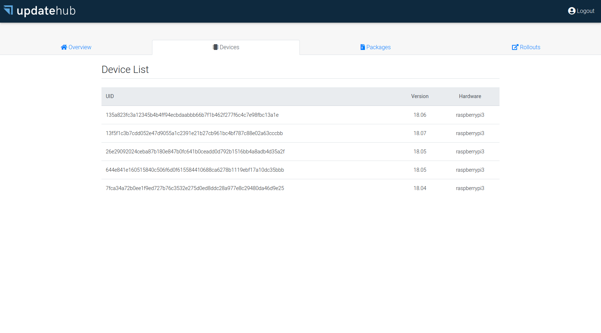

UpdateHub Community Edition Server
==================================

> This is community edition of [UpdateHub](https://updatehub.io).
An end-to-end solution for large scale over-the-air update of devices.



## Usage

```
$ docker run updatehub/updatehub-ce-server --help
Usage:
  updatehub-ce-server [flags]

Flags:
      --db string         Database file (default "updatehub.db")
  -h, --help              help for updatehub-ce-server
      --password string   Admin password (default "admin")
      --port int          Port (default 8080)
      --username string   Admin username (default "admin")

Example:
docker run -d -p 8080:8080 updatehub/updatehub-ce-server:latest

```

## Development setup

The `updatehub-ce-server` uses `glide` to manage its dependencies and
`npm` to build the web UI for the server.  The easiest way to install
its latest release on Mac or Linux is with the following script:

```
$ curl https://glide.sh/get | sh
```

On Mac OS X you can also install the latest release via Homebrew:

```
$ brew install glide node
```

On Ubuntu Precise (12.04), Trusty (14.04), Wily (15.10) or Xenial
(16.04) you can install from our PPA:

```
$ sudo add-apt-repository ppa:masterminds/glide && sudo apt-get update
$ sudo apt-get install glide nodejs npm
```

After that, need to install `packr` that is a simple solution for
bundling static assets inside of Go binaries use by
`updatehub-ce-server`.

To install Packr utility and the dependencies:

```
$ go get -u github.com/gobuffalo/packr/packr
$ go get -u github.com/gobuffalo/packr
```


Finally, you can build `updatehub-ce-server` as:

```
$ cd <YOUR-UPDATEHUB-CE-SERVER-PATH>/ui/ && npm install && npm run build && cd ..
$ packr install
$ go build
$ go install
```

Now you can run the `updatehub-ce-server` as:

```
./updatehub-ce-server --http 8080
```

## License

Licensed under MIT, ([LICENSE](LICENSE) or https://opensource.org/licenses/MIT).

### Contribution

Unless you explicitly state otherwise, any contribution intentionally
submitted for inclusion in the work by you, as defined in the MIT
license, shall be licensed as above, without any additional terms or
conditions.
